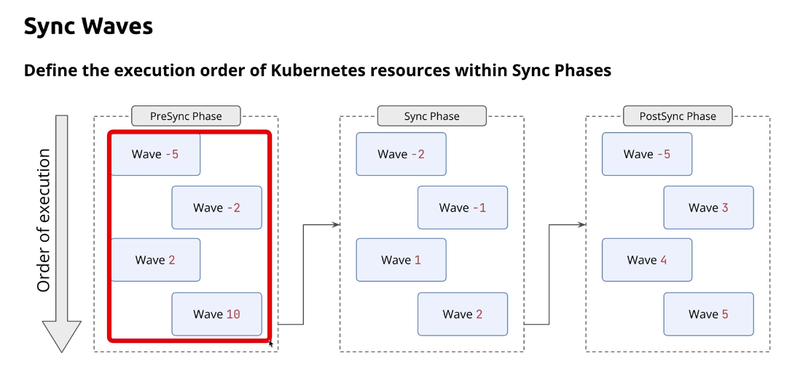

**Drawbacks of Traditional Push**

**kubectl scale deployment my-app --replicas=0**

- git push -> CI/CD -> Cluster: This causes config drift, poor auditability , difficult rollbacks, inconsistent deployments

---

**GitOps**


**Principles**


---


**ArgoCD Architecture**


- Understanding the role of API Server, Repository Server and Application Controller


---

**Significance of an AppProject in Argo CD**
An AppProject is a logical boundary or policy container in Argo CD. It controls which applications are allowed to deploy and where they can deploy.

Main purpose
Organizes apps into groups
Enforces security and access rules
Restricts deployment destinations
Limits which Git repositories can be used
Controls which Kubernetes resources can be deployed
Helps manage multi-team or multi-environment setups
Example meaning
If you define a project like Finance Project:

```yaml
apiVersion: argoproj.io/v1alpha1
kind: AppProject
metadata:
  name: financeproject
  namespace: argocd
spec:
  sourceRepos:
    - 'https://github.com/venkatamamidibathula/guestbookprivaterepo.git'
  destinations:
    - namespace: finance
      server: https://kubernetes.default.svc

```


This means:

Only this Git repo is allowed
Applications in this project can deploy only to the finance namespace on the default cluster
Why it matters
Without an AppProject:

Applications may be too broad
Teams could deploy to any namespace or repo
Security and governance become weak
In short
An AppProject is the “access control and deployment policy” layer for Argo CD applications.


**Nutshell**

Create Namespace -> AppProject (Links namespace to ArgoApp to Namespce)

**ArgoCDApp**

```yaml
apiVersion: argoproj.io/v1alpha1
kind: Application
metadata:
  name: financeapp
  namespace: argocd
spec:
  project: financeproject

  source:
    repoURL: https://github.com/venkatamamidibathula/guestbookprivaterepo.git
    targetRevision: master
    path: helm-guestbook

  destination:
    server: https://kubernetes.default.svc
    namespace: finance
  syncPolicy:
    automated:
      prune: true

```

---

**argocd auto sync**

- **selfHeal:true** - This ensures whenever someone makes changes to live cluster like scaling the deployment to 6 replicas where as the kubernetes manifests still has 2. This option brings back the pods to 2.

```yaml
  syncPolicy:
    automated:
      prune: true
      selfHeal: true
```
---

**PROJECTS**

- Manage and segregate multiple ArgoCD applications at scale.


---

**Sync Phases**


---

**Sync Waves**





---


