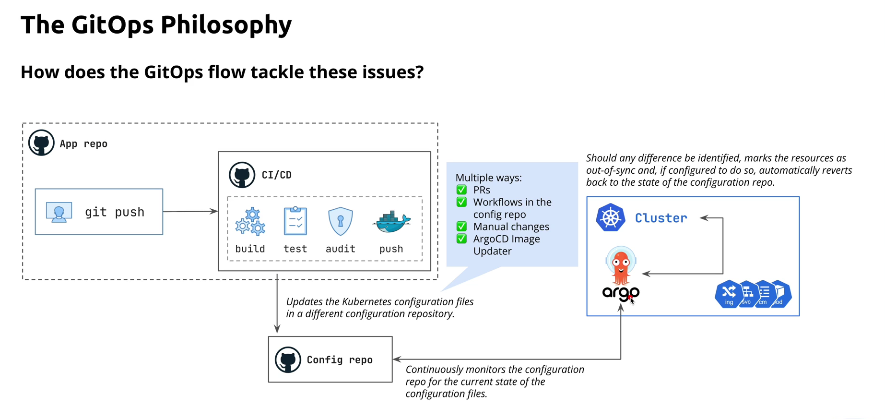
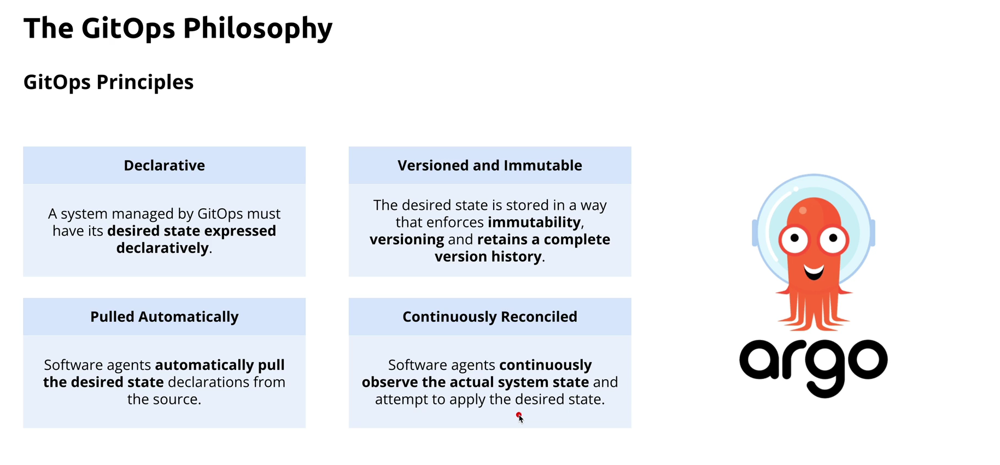
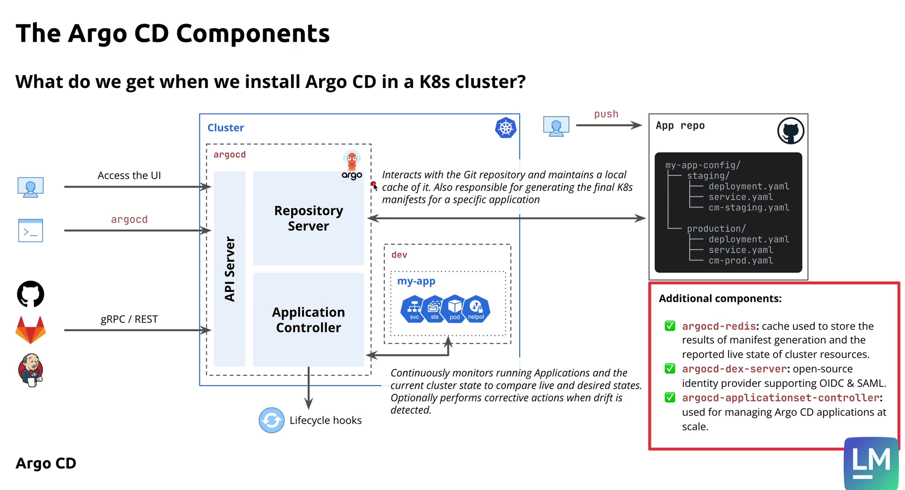
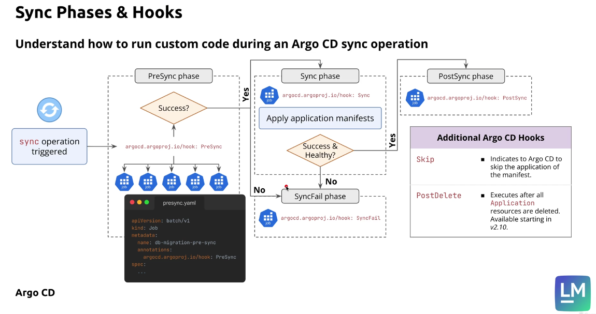
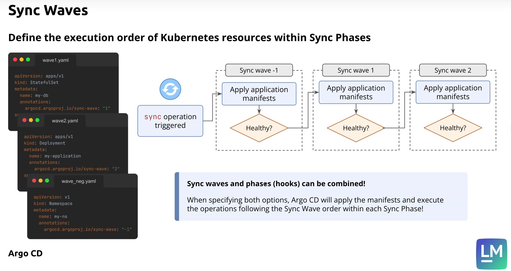
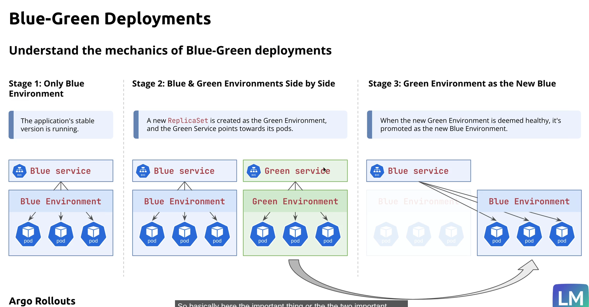
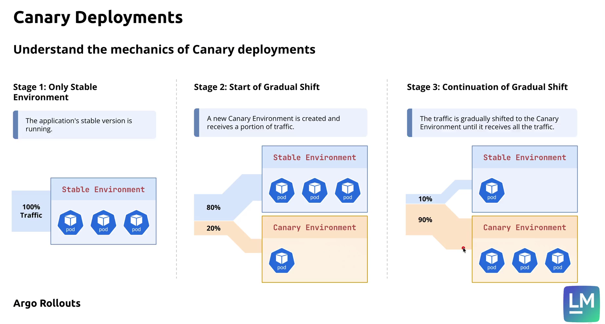

**Drawbacks of Traditional Push**

**kubectl scale deployment my-app --replicas=0**

- git push -> CI/CD -> Cluster: This causes config drift, poor auditability , difficult rollbacks, inconsistent deployments

---

**GitOps**




**Principles**




---


**ArgoCD Architecture**


- Understanding the role of API Server, Repository Server and Application Controller





---

**Significance of an AppProject in Argo CD**
An AppProject is a logical boundary or policy container in Argo CD. It controls which applications are allowed to deploy and where they can deploy.

Main purpose
Organizes apps into groups
Enforces security and access rules
Restricts deployment destinations
Limits which Git repositories can be used
Controls which Kubernetes resources can be deployed
Helps manage multi-team or multi-environment setups
Example meaning
If you define a project like Finance Project:

```yaml
apiVersion: argoproj.io/v1alpha1
kind: AppProject
metadata:
  name: financeproject
  namespace: argocd
spec:
  sourceRepos:
    - 'https://github.com/venkatamamidibathula/guestbookprivaterepo.git'
  destinations:
    - namespace: finance
      server: https://kubernetes.default.svc

```


This means:

Only this Git repo is allowed
Applications in this project can deploy only to the finance namespace on the default cluster
Why it matters
Without an AppProject:

Applications may be too broad
Teams could deploy to any namespace or repo
Security and governance become weak
In short
An AppProject is the “access control and deployment policy” layer for Argo CD applications.


**Nutshell**

Create Namespace -> AppProject (Links namespace to ArgoApp to Namespce)

**ArgoCDApp**

```yaml
apiVersion: argoproj.io/v1alpha1
kind: Application
metadata:
  name: financeapp
  namespace: argocd
spec:
  project: financeproject

  source:
    repoURL: https://github.com/venkatamamidibathula/guestbookprivaterepo.git
    targetRevision: master
    path: helm-guestbook

  destination:
    server: https://kubernetes.default.svc
    namespace: finance
  syncPolicy:
    automated:
      prune: true

```

---

**argocd auto sync**

- **selfHeal:true** - This ensures whenever someone makes changes to live cluster like scaling the deployment to 6 replicas where as the kubernetes manifests still has 2. This option brings back the pods to 2.

```yaml
  syncPolicy:
    automated:
      prune: true
      selfHeal: true
```
---

**PROJECTS**

- Manage and segregate multiple ArgoCD applications at scale.


---

**Sync Phases**




Sync phases are defined on application kubernetes manifests and not on argocd projects

```yaml
apiVersion: batch/v1
kind: Job
metadata:
  name: {{ template "helm-guestbook.fullname" . }}-job
  labels:
    app: {{ template "helm-guestbook.name" . }}
    chart: {{ template "helm-guestbook.chart" . }}
    release: {{ .Release.Name }}
    heritage: {{ .Release.Service }}
  annotations:
    argocd.argoproj.io/hook: PreSync
    argocd.argoproj.io/hook-delete-policy: BeforeHookCreation,HookSucceeded 
spec:
  template:
    metadata:
      name: {{ template "helm-guestbook.fullname" . }}-job
      labels:
        app: {{ template "helm-guestbook.name" . }}
        release: {{ .Release.Name }}
    spec:
      containers:
        - name: {{ .Chart.Name }}-job
          image: busybox:1.28
          imagePullPolicy: IfNotPresent
          command: ['sh', '-c', 'echo Hello Kubernetes! && sleep 30']
      restartPolicy: Never
```


---

**Sync Waves**

Defines the execution of kubernetes manifests on cluster. The sync wave annotation with least value executes first followed by subsequent higher numbers in ascending order.




Syncwaves and Syncphases can be combined where in which within each sync phase there can be sync waves defined.

These are defined in application kubernetes manifests and not on argocd projects. It is always better to use multiples of 10 than going for 1,2,3,....etc.


---

**Deployment**

**Blue Green**
A stable running blue deployment needs to be updated to target green deployments.





The downside of blue green is you have to spin up a new green environment which strains the underlying resouces like memory and compute and adds cost


**Canary Deployment**

Remember the word "Canary in a coal mine"





